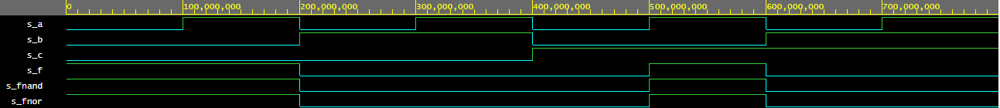

# Lab 01-gates

## De Morgan's laws simulation

### Source code

```vhdl
architecture dataflow of gates is
begin
    f_o     <= ((not b_i) and a_i) or ((not c_i) and (not b_i));
    fnand_o <= ((b_i nand b_i) nand (a_i)) nand ((c_i nand c_i) nand (b_i nand b_i));
    fnor_o  <= (((b_i) nor (a_i nor a_i)) nor ((c_i) nor (b_i))) nor (((b_i) nor (a_i nor a_i)) nor ((c_i) nor (b_i)));
```

### Graph



### EDA playground link

[https://www.edaplayground.com/x/a_5b](https://www.edaplayground.com/x/a_5b)

### EDA playground link

| **c** | **b** |**a** | **f(c,b,a)** |
| :-: | :-: | :-: | :-: |
| 0 | 0 | 0 | 1 |
| 0 | 0 | 1 | 1 |
| 0 | 1 | 0 | 0 |
| 0 | 1 | 1 | 0 |
| 1 | 0 | 0 | 0 |
| 1 | 0 | 1 | 1 |
| 1 | 1 | 0 | 0 |
| 1 | 1 | 1 | 0 |
