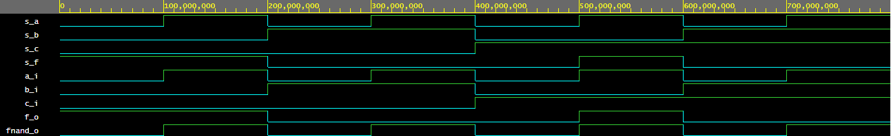

# Nadpis 2


####De Morgan's laws simulation

```vhdl
architecture dataflow of gates is
begin
    f_o  <= ((not b_i) and a_i) or ((not c_i) and (not b_i));
    fnand_o  <= ;
    --fand_o <= a_i and b_i;
    --fxor_o <= a_i xor b_i;

end architecture dataflow;
```


[https://www.edaplayground.com/x/a_5b](https://www.edaplayground.com/x/a_5b)