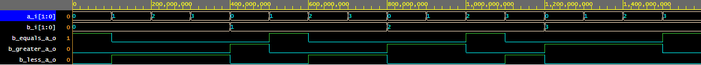

# Lab 02-logic

[https://github.com/xcadaj00/Digital-electronics-1/](https://github.com/xcadaj00/Digital-electronics-1/)

## Binary comparator truth table

| **Dec. equivalent** | **B[1:0]** | **A[1:0]** | **B is greater than A** | **B equals A** | **B is less than A** |
| :-: | :-: | :-: | :-: | :-: | :-: |
| 0 | 0 0 | 0 0 | 0 | 1 | 0 |
| 1 | 0 0 | 0 1 | 0 | 0 | 1 |
| 2 | 0 0 | 1 0 | 0 | 0 | 1 |
| 3 | 0 0 | 1 1 | 0 | 0 | 1 |
| 4 | 0 1 | 0 0 | 1 | 0 | 0 |
| 5 | 0 1 | 0 1 | 0 | 1 | 0 |
| 6 | 0 1 | 1 0 | 0 | 0 | 1 |
| 7 | 0 1 | 1 1 | 0 | 0 | 1 |
| 8 | 1 0 | 0 0 | 1 | 0 | 0 |
| 9 | 1 0 | 0 1 | 1 | 0 | 0 |
| 10 | 1 0 | 1 0 | 0 | 1 | 0 |
| 11 | 1 0 | 1 1 | 0 | 0 | 1 |
| 12 | 1 1 | 0 0 | 1 | 0 | 0 |
| 13 | 1 1 | 0 1 | 1 | 0 | 0 |
| 14 | 1 1 | 1 0 | 1 | 0 | 0 |
| 15 | 1 1 | 1 1 | 0 | 1 | 0 |


## 2-bit comparator

### Karnaugh maps


### Graph



### EDA playground link

[https://www.edaplayground.com/x/8Qv9](https://www.edaplayground.com/x/8Qv9)

## 4-bit comparator

### design.vhd

```vhdl
------------------------------------------------------------------------
--
-- Example of 2-bit binary comparator using the when/else assignment.
-- EDA Playground
--
-- Copyright (c) 2020-2021 Tomas Fryza
-- Dept. of Radio Electronics, Brno University of Technology, Czechia
-- This work is licensed under the terms of the MIT license.
--
------------------------------------------------------------------------

library ieee;
use ieee.std_logic_1164.all;

------------------------------------------------------------------------
-- Entity declaration for 4-bit binary comparator
------------------------------------------------------------------------
entity comparator_4bit is
    port(
        a_i           : in  std_logic_vector(4 - 1 downto 0);
    	b_i           : in  std_logic_vector(4 - 1 downto 0);

        -- COMPLETE ENTITY DECLARATION
        B_greater_A_o : out std_logic;
        B_equals_A_o  : out std_logic;
        B_less_A_o    : out std_logic      -- B is less than A
    );
end entity comparator_4bit;

------------------------------------------------------------------------
-- Architecture body for 2-bit binary comparator
------------------------------------------------------------------------
architecture Behavioral of comparator_4bit is
begin
    B_equals_A_o  <= '1' when (b_i = a_i) else '0';
    B_greater_A_o <= '1' when (b_i > a_i) else '0';
    B_less_A_o    <= '1' when (b_i < a_i) else '0';


    -- WRITE "GREATER" AND "EQUALS" ASSIGNMENTS HERE


end architecture Behavioral;
```


### Source code

```vhdl
architecture dataflow of gates is
begin
    f_o     <= ((not b_i) and a_i) or ((not c_i) and (not b_i));
    fnand_o <= ((b_i nand b_i) nand (a_i)) nand ((c_i nand c_i) nand (b_i nand b_i));
    fnor_o  <= (((b_i) nor (a_i nor a_i)) nor ((c_i) nor (b_i))) nor (((b_i) nor (a_i nor a_i)) nor ((c_i) nor (b_i)));
end architecture dataflow;
```


### Graph


### EDA playground link

[https://www.edaplayground.com/x/a_5b](https://www.edaplayground.com/x/a_5b)

### Table

| **c** | **b** |**a** | **f(c,b,a)** |
| :-: | :-: | :-: | :-: |
| 0 | 0 | 0 | 1 |
| 0 | 0 | 1 | 1 |
| 0 | 1 | 0 | 0 |
| 0 | 1 | 1 | 0 |
| 1 | 0 | 0 | 0 |
| 1 | 0 | 1 | 1 |
| 1 | 1 | 0 | 0 |
| 1 | 1 | 1 | 0 |
