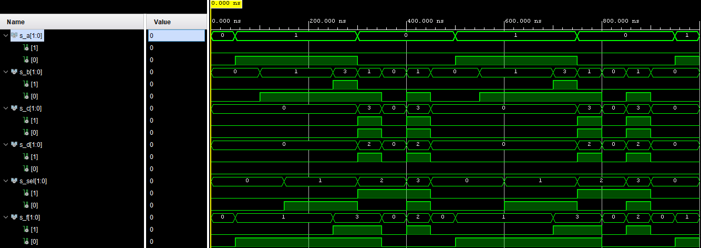

# Lab 03-vivado

[https://github.com/xcadaj00/Digital-electronics-1/](https://github.com/xcadaj00/Digital-electronics-1/)

## Tables with connection of 16 slide switches and 16 LEDs on Nexys A7 board

### Slide switches

| **Component** | **Pin** | **High state voltage ** |
| :-: | :-: | :-: |
| SW0 | J15 | 3.3V |
| SW1 | L16 | 3.3V |
| SW2 | M13 | 3.3V |
| SW3 | R15 | 3.3V |
| SW4 | R17 | 3.3V |
| SW5 | T18 | 3.3V |
| SW6 | U18 | 3.3V |
| SW7 | R13 | 3.3V |
| SW8 | T8 | 1.8V |
| SW9 | U8 | 1.8V |
| SW10 | R16 | 3.3V |
| SW11 | T13 | 3.3V |
| SW12 | H6 | 3.3V |
| SW13 | U12 | 3.3V |
| SW14 | U11 | 3.3V |
| SW15 | V10 | 3.3V |

### LEDs

All LEDs are on when pin is pulled high

| **Component** | **Pin** |
| :-: | :-: |
| LED0 | H17 |
| LED1 | K15 |
| LED2 | J13 |
| LED3 | N14 |
| LED4 | R18 |
| LED5 | V17 |
| LED6 | U17 |
| LED7 | U16 |
| LED8 | V16 |
| LED9 | T15 |
| LED10 | U14 |
| LED11 | T16 |
| LED12 | V15 |
| LED13 | V14 |
| LED14 | V12 |
| LED15 | V11 |


## Two-bit wide 4-to-1 multiplexer

### VHDL architecture

```vhdl
architecture Behavioral of mux_2bit_4to1 is
begin
    f_o  <= a_i when (sel_i = "00") else
            b_i when (sel_i = "01") else
            c_i when (sel_i = "10") else
            d_i;
end architecture Behavioral;
```

### VHDL stimulus process

```vhdl
p_stimulus : process
    begin
        -- Report a note at the begining of stimulus process
        report "Stimulus process started" severity note;


        -- First test values
        s_d <= "00"; s_c <= "00"; s_b <= "00"; s_a <= "00";
        s_sel <= "00"; wait for 50 ns;
        
        s_a <= "01"; wait for 50 ns;
        s_b <= "01"; wait for 50 ns;
        
        s_sel <= "01"; wait for 50 ns;
        s_c <= "00"; wait for 50 ns;
        s_b <= "11"; wait for 50 ns;
        
        s_d <= "10"; s_c <= "11"; s_b <= "01"; s_a <= "00"; 
        s_sel <= "10"; wait for 50 ns;
        
        s_d <= "00"; s_c <= "00"; s_b <= "00"; s_a <= "00"; 
        s_sel <= "10"; wait for 50 ns;
        
        s_d <= "10"; s_c <= "11"; s_b <= "01"; s_a <= "00";
        s_sel <= "11"; wait for 50 ns;

        -- Report a note at the end of stimulus process
        report "Stimulus process finished" severity note;
        --wait;
    end process p_stimulus;
```

### Screenshot with simulated time waveforms



## A Vivado tutorial


