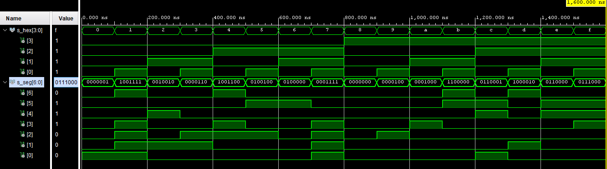
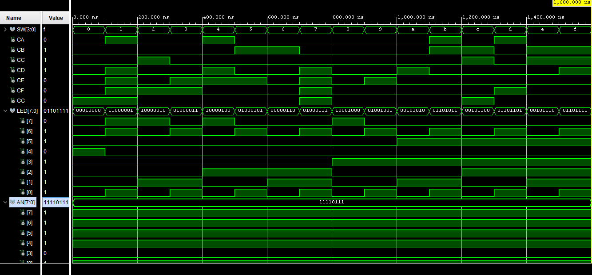

# Lab 04-segment

[https://github.com/xcadaj00/Digital-electronics-1/](https://github.com/xcadaj00/Digital-electronics-1/)

## Preparation tasks

### Tables with connection of 7-segment displays on Nexys A7 board

#### Cathodes

LEDs light up when cathode is low (i.e. 0)

| **Component** | **Pin** |
| :-: | :-: |
| CA | T10 |
| CB | R10 |
| CC | K16 |
| CD | K13 |
| CE | P15 |
| CF | T11 |
| CG | L18 |

#### Anodes

Transistor is closed when 3.3V applied to its base throught resistor, when 0V applied, transistor will open so digit can light up.

| **Component** | **Pin** |
| :-: | :-: |
| AN[0] | J17 |
| AN[1] | J18 |
| AN[2] | T9 |
| AN[3] | J14 |
| AN[4] | P14 |
| AN[5] | T14 |
| AN[6] | K2 |
| AN[7] | U13 |

### Decoder truth table for common anode 7-segment display

| **Hex** | **Inputs** | **A** | **B** | **C** | **D** | **E** | **F** | **G** |
| :-: | :-: | :-: | :-: | :-: | :-: | :-: | :-: | :-: |
| 0 | 0000 | 0 | 0 | 0 | 0 | 0 | 0 | 1 |
| 1 | 0001 | 1 | 0 | 0 | 1 | 1 | 1 | 1 |
| 2 | 0010 | 0 | 0 | 1 | 0 | 0 | 1 | 0 |
| 3 | 0011 | 0 | 0 | 0 | 0 | 1 | 1 | 0 |
| 4 | 0100 | 1 | 0 | 0 | 1 | 1 | 0 | 0 |
| 5 | 0101 | 0 | 1 | 0 | 0 | 1 | 0 | 0 |
| 6 | 0110 | 0 | 1 | 0 | 0 | 0 | 0 | 0 |
| 7 | 0111 | 0 | 0 | 0 | 1 | 1 | 1 | 1 |
| 8 | 1000 | 0 | 0 | 0 | 0 | 0 | 0 | 0 |
| 9 | 1001 | 0 | 0 | 0 | 0 | 1 | 0 | 0 |
| A | 1010 | 0 | 0 | 0 | 1 | 0 | 0 | 0 |
| b | 1011 | 1 | 1 | 0 | 0 | 0 | 0 | 0 |
| C | 1100 | 0 | 1 | 1 | 0 | 0 | 0 | 1 |
| d | 1101 | 1 | 0 | 0 | 0 | 0 | 1 | 0 |
| E | 1110 | 0 | 1 | 1 | 0 | 0 | 0 | 0 |
| F | 1111 | 0 | 1 | 1 | 1 | 0 | 0 | 0 |


## Seven-segment display decoder

### VHDL architecture from source file hex_7seg.vhd

```vhdl
architecture Behavioral of hex_7seg is

begin

    --------------------------------------------------------------------
    -- p_7seg_decoder:
    -- A combinational process for 7-segment display decoder. 
    -- Any time "hex_i" is changed, the process is "executed".
    -- Output pin seg_o(6) corresponds to segment A, seg_o(5) to B, etc.
    --------------------------------------------------------------------
    p_7seg_decoder : process(hex_i)
    begin
        case hex_i is
            when "0000" =>
                seg_o <= "0000001";     -- 0
            when "0001" =>
                seg_o <= "1001111";     -- 1
            when "0010" =>
                seg_o <= "0010010";     -- 2
            when "0011" =>
                seg_o <= "0000110";     -- 3
            when "0100" =>
                seg_o <= "1001100";     -- 4
            when "0101" =>
                seg_o <= "0100100";     -- 5
            when "0110" =>
                seg_o <= "0100000";     -- 6
            when "0111" =>
                seg_o <= "0001111";     -- 7
            when "1000" =>
                seg_o <= "0000000";     -- 8
            when "1001" =>
                seg_o <= "0000100";     -- 9
            when "1010" =>
                seg_o <= "0001000";     -- A
            when "1011" =>
                seg_o <= "1100000";     -- B
            when "1100" =>
                seg_o <= "0110001";     -- C
            when "1101" =>
                seg_o <= "1000010";     -- D
            when "1110" =>
                seg_o <= "0110000";     -- E
            when others =>
                seg_o <= "0111000";     -- F
        end case;
    end process p_7seg_decoder;


end Behavioral;
```

### VHDL stimulus process from testbench file tb_hex_7seg.vhd

```vhdl
p_stimulus : process
    begin
        -- Report a note at the begining of stimulus process
        report "Stimulus process started" severity note;

        s_hex <= "0000"; wait for 100 ns;
        
        s_hex <= "0001"; wait for 100 ns;
        
        s_hex <= "0010"; wait for 100 ns;
        
        s_hex <= "0011"; wait for 100 ns;
        
        s_hex <= "0100"; wait for 100 ns;
       
        s_hex <= "0101"; wait for 100 ns;
        
        s_hex <= "0110"; wait for 100 ns;
        
        s_hex <= "0111"; wait for 100 ns;
        
        s_hex <= "1000"; wait for 100 ns;
        
        s_hex <= "1001"; wait for 100 ns;
        
        s_hex <= "1010"; wait for 100 ns;
        
        s_hex <= "1011"; wait for 100 ns;
        
        s_hex <= "1100"; wait for 100 ns;
        
        s_hex <= "1101"; wait for 100 ns;
        
        s_hex <= "1110"; wait for 100 ns;
        
        s_hex <= "1111"; wait for 100 ns;

        -- Report a note at the end of stimulus process
        report "Stimulus process finished" severity note;
        wait;
    end process p_stimulus;
```

### Screenshot with simulated time waveforms



### Listing of VHDL code from source file top.vhd with 7-segment module instantiation

```vhdl
----------------------------------------------------------------------------------
-- Company: 
-- Engineer: 
-- 
-- Create Date: 03.03.2021 16:02:21
-- Design Name: 
-- Module Name: top - Behavioral
-- Project Name: 
-- Target Devices: 
-- Tool Versions: 
-- Description: 
-- 
-- Dependencies: 
-- 
-- Revision:
-- Revision 0.01 - File Created
-- Additional Comments:
-- 
----------------------------------------------------------------------------------


library IEEE;
use IEEE.STD_LOGIC_1164.ALL;

-- Uncomment the following library declaration if using
-- arithmetic functions with Signed or Unsigned values
--use IEEE.NUMERIC_STD.ALL;

-- Uncomment the following library declaration if instantiating
-- any Xilinx leaf cells in this code.
--library UNISIM;
--use UNISIM.VComponents.all;

entity top is
    Port ( 
        SW : in STD_LOGIC_VECTOR (4 - 1 downto 0); -- Input binary data
        CA : out STD_LOGIC; -- 	Cathod A
        CB : out STD_LOGIC; -- 	Cathod B
        CC : out STD_LOGIC; -- 	Cathod C
        CD : out STD_LOGIC; -- 	Cathod D
        CE : out STD_LOGIC; -- 	Cathod E
        CF : out STD_LOGIC; -- 	Cathod F
        CG : out STD_LOGIC; -- 	Cathod G
        
        LED : out STD_LOGIC_VECTOR (8 - 1 downto 0); -- LED indicators
        AN  : out STD_LOGIC_VECTOR (8 - 1 downto 0) -- Common anode signals to individual displays
    );
end top;

architecture Behavioral of top is

-- Used to test it without physical board
--        signal SW : STD_LOGIC_VECTOR (4 - 1 downto 0); -- Input binary data
--        signal CA : STD_LOGIC; -- 	Cathod A
--        signal CB : STD_LOGIC; -- 	Cathod B
--        signal CC : STD_LOGIC; -- 	Cathod C
--        signal CD : STD_LOGIC; -- 	Cathod D
--        signal CE : STD_LOGIC; -- 	Cathod E
--        signal CF : STD_LOGIC; -- 	Cathod F
--        signal CG : STD_LOGIC; -- 	Cathod G
        
--        signal LED : STD_LOGIC_VECTOR (8 - 1 downto 0); -- LED indicators
--        signal AN  : STD_LOGIC_VECTOR (8 - 1 downto 0); -- Common anode signals to individual displays

begin

    --------------------------------------------------------------------
    -- Instance (copy) of hex_7seg entity
    hex2seg : entity work.hex_7seg
        port map(
            hex_i    => SW,
            
            seg_o(6) => CA,
            seg_o(5) => CB,
            seg_o(4) => CC,
            seg_o(3) => CD,
            seg_o(2) => CE,
            seg_o(1) => CF,
            seg_o(0) => CG
        );

    -- Connect one common anode to 3.3V
    AN <= b"1111_0111";
    
    -- Display input value
    LED(3 downto 0) <= SW;
    
    -- Turn LED(4) on if input value is equal to 0, ie "0000"
    LED(4)  <= '1' when (SW = "0000") else '0';
     
    -- Turn LED(5) on if input value is greater than "1001"
    LED(5)  <= '1' when (SW > "1001") else '0';
    
    -- Turn LED(6) on if input value is odd, ie 1, 3, 5, ...
    LED(6)  <= SW(0);
    
    -- Turn LED(7) on if input value is a power of two, ie 1, 2, 4, or 8
    LED(7)  <= '1' when (SW = "0001" or SW = "0010" or SW = "0100" or SW = "1000") else '0';
    
--    Used to test it without physical board

--    p_stimulus : process
--    begin
--        -- Report a note at the begining of stimulus process
--        report "Stimulus process started" severity note;

--        SW <= "0000"; wait for 100 ns;
        
--        SW <= "0001"; wait for 100 ns;
        
--        SW <= "0010"; wait for 100 ns;
        
--        SW <= "0011"; wait for 100 ns;
        
--        SW <= "0100"; wait for 100 ns;
       
--        SW <= "0101"; wait for 100 ns;
        
--        SW <= "0110"; wait for 100 ns;
        
--        SW <= "0111"; wait for 100 ns;
        
--        SW <= "1000"; wait for 100 ns;
        
--        SW <= "1001"; wait for 100 ns;
        
--        SW <= "1010"; wait for 100 ns;
        
--        SW <= "1011"; wait for 100 ns;
        
--        SW <= "1100"; wait for 100 ns;
        
--        SW <= "1101"; wait for 100 ns;
        
--        SW <= "1110"; wait for 100 ns;
        
--        SW <= "1111"; wait for 100 ns;

--        -- Report a note at the end of stimulus process
--        report "Stimulus process finished" severity note;
--        wait;
--    end process p_stimulus;
    
end Behavioral;

```

## LED(7:4) indicators

### Truth table

| **Hex** | **Inputs** | **LED4** | **LED5** | **LED6** | **LED7** |
| :-: | :-: | :-: | :-: | :-: | :-: |
| 0 | 0000 | 1 | 0 | 0 | 0 |
| 1 | 0001 | 0 | 0 | 1 | 1 |
| 2 | 0010 | 0 | 0 | 0 | 1 |
| 3 | 0011 | 0 | 0 | 1 | 0 |
| 4 | 0100 | 0 | 0 | 0 | 1 |
| 5 | 0101 | 0 | 0 | 1 | 0 |
| 6 | 0110 | 0 | 0 | 0 | 0 |
| 7 | 0111 | 0 | 0 | 1 | 0 |
| 8 | 1000 | 0 | 0 | 0 | 1 |
| 9 | 1001 | 0 | 0 | 1 | 0 |
| A | 1010 | 0 | 1 | 0 | 0 |
| b | 1011 | 0 | 1 | 1 | 0 |
| C | 1100 | 0 | 1 | 0 | 0 |
| d | 1101 | 0 | 1 | 1 | 0 |
| E | 1110 | 0 | 1 | 0 | 0 |
| F | 1111 | 0 | 1 | 1 | 0 |

### VHDL code

```vhdl
-- Turn LED(4) on if input value is equal to 0, ie "0000"
    LED(4)  <= '1' when (SW = "0000") else '0';
     
    -- Turn LED(5) on if input value is greater than "1001"
    LED(5)  <= '1' when (SW > "1001") else '0';
    
    -- Turn LED(6) on if input value is odd, ie 1, 3, 5, ...
    LED(6)  <= SW(0);
    
    -- Turn LED(7) on if input value is a power of two, ie 1, 2, 4, or 8
    LED(7)  <= '1' when (SW = "0001" or SW = "0010" or SW = "0100" or SW = "1000") else '0';
```

### Screenshot with simulated time waveforms


