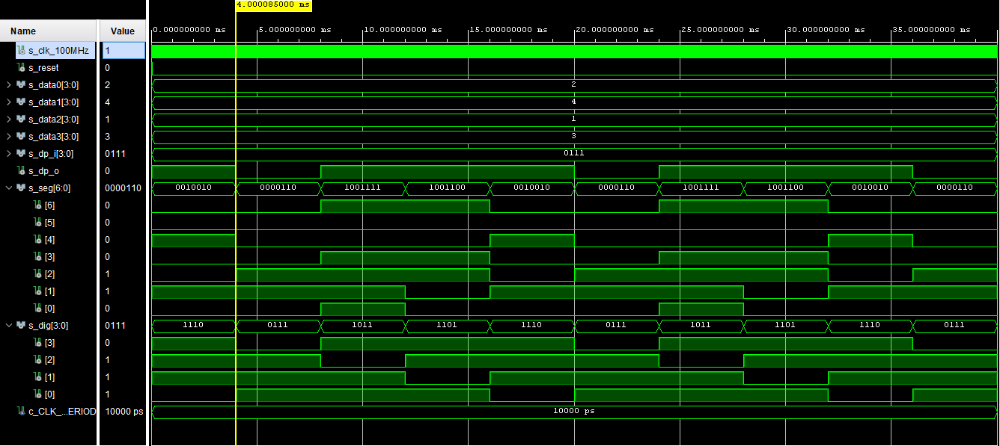

# Lab 06-display_driver

[https://github.com/xcadaj00/Digital-electronics-1/](https://github.com/xcadaj00/Digital-electronics-1/)

## Preparation tasks

### Timing diagram figure for displaying value `3.142`


## Display driver

### Listing of VHDL code of the process p_mux with syntax highlighting

```vhdl
p_mux : process(s_cnt, data0_i, data1_i, data2_i, data3_i, dp_i) -- all variables in () runs this process when changed
begin
	case s_cnt is
		when "11" =>
			s_hex <= data3_i;
			dp_o  <= dp_i(3);
			dig_o <= "0111";

		when "10" =>
			s_hex <= data2_i;
			dp_o  <= dp_i(2);
			dig_o <= "1011";

		when "01" =>
			s_hex <= data1_i;
			dp_o  <= dp_i(1);
			dig_o <= "1101";

		when others =>
			s_hex <= data0_i;
			dp_o  <= dp_i(0);
			dig_o <= "1110";
	end case;
end process p_mux;
```

### Listing of VHDL testbench file tb_driver_7seg_4digits with syntax highlighting and asserts

```vhdl
------------------------------------------------------------------------
--
-- Template for 4-digit 7-segment display driver testbench.
-- Nexys A7-50T, Vivado v2020.1.1, EDA Playground
--
-- Copyright (c) 2020 Tomas Fryza
-- Dept. of Radio Electronics, Brno University of Technology, Czechia
-- This work is licensed under the terms of the MIT license.
--
------------------------------------------------------------------------

library ieee;
use ieee.std_logic_1164.all;

------------------------------------------------------------------------
-- Entity declaration for testbench
------------------------------------------------------------------------
entity tb_driver_7seg_4digits is
    -- Entity of testbench is always empty
end entity tb_driver_7seg_4digits;

------------------------------------------------------------------------
-- Architecture body for testbench
------------------------------------------------------------------------
architecture testbench of tb_driver_7seg_4digits is

    -- Local constants
    constant c_CLK_100MHZ_PERIOD : time    := 10 ns;

    --Local signals
    signal s_clk_100MHz    : std_logic;
    --- WRITE YOUR CODE HERE
    signal s_reset         : std_logic;
    signal s_data0         : std_logic_vector(4 - 1 downto 0);
    signal s_data1         : std_logic_vector(4 - 1 downto 0);
    signal s_data2         : std_logic_vector(4 - 1 downto 0);
    signal s_data3         : std_logic_vector(4 - 1 downto 0);
    
    signal s_dp_i          : std_logic_vector(4 - 1 downto 0);
    signal s_dp_o          : std_logic;
    signal s_seg           : std_logic_vector(7 - 1 downto 0);
    
    signal s_dig           : std_logic_vector(4 - 1 downto 0);

begin
    -- Connecting testbench signals with driver_7seg_4digits entity
    -- (Unit Under Test)
    --- WRITE YOUR CODE HERE
    uut_driver_7seg_4digits : entity work.driver_7seg_4digits
        port map(
            clk      => s_clk_100MHz,
            reset    => s_reset,
            
            data0_i  => s_data0,
            data1_i  => s_data1,
            data2_i  => s_data2,
            data3_i  => s_data3,
            
            dp_i     => s_dp_i,
            
            dp_o     => s_dp_o,
            
            seg_o    => s_seg,
            
            dig_o    => s_dig
        );
    
    --------------------------------------------------------------------
    -- Clock generation process
    --------------------------------------------------------------------
    p_clk_gen : process
    begin
        while now < 40 ms loop        
            s_clk_100MHz <= '0';
            wait for c_CLK_100MHZ_PERIOD / 2;
            s_clk_100MHz <= '1';
            wait for c_CLK_100MHZ_PERIOD / 2;
        end loop;
        wait;
    end process p_clk_gen;

    --------------------------------------------------------------------
    -- Reset generation process
    --------------------------------------------------------------------
    --- WRITE YOUR CODE HERE


     p_reset_gen : process
        begin
            s_reset <= '0';
            wait for 28 ns;
            
            -- Reset activated
            s_reset <= '1';
            wait for 53 ns;
    
            --Reset deactivated
            s_reset <= '0';
            
            --wait for 700 ns;
            --s_reset <= '1';
    
            wait;
     end process p_reset_gen;

    --------------------------------------------------------------------
    -- Data generation process
    --------------------------------------------------------------------
    p_stimulus : process
    begin
        report "Stimulus process started" severity note;
        -- 3.142
        s_data3 <= "0011";
        s_data2 <= "0001";
        s_data1 <= "0100";
        s_data0 <= "0010";
               
        s_dp_i  <= "0111";
        
        wait for 6 ms;
        
        assert ((s_dig = "0111") and (s_seg = "0000110") and (s_dp_o = '0'))
        report "Test failed for input: '3.' " severity error;
        
        wait for 4 ms;
        
        assert ((s_dig = "1011") and (s_seg = "1001111") and (s_dp_o = '1'))
        report "Test failed for input: '1' " severity error;
        
        wait for 4 ms;
        
        assert ((s_dig = "1101") and (s_seg = "1001100") and (s_dp_o = '1'))
        report "Test failed for input: '4' " severity error;
        
        wait for 4 ms;
        
        assert ((s_dig = "1110") and (s_seg = "0010010") and (s_dp_o = '1'))
        report "Test failed for input: '2' " severity error;
        
        
    
        report "Stimulus process finished" severity note;
        wait;
    end process p_stimulus;
    

end architecture testbench;
```

### Screenshot with simulated time waveforms; always display all inputs and outputs



### Listing of VHDL architecture of the top layer

```vhdl
architecture Behavioral of top is
    -- No internal signals
begin

    --------------------------------------------------------------------
    -- Instance (copy) of driver_7seg_4digits entity
    driver_seg_4 : entity work.driver_7seg_4digits
        port map(
            clk        => CLK100MHZ,
            reset      => BTNC,
            
            data0_i(3) => SW(3),
            data0_i(2) => SW(2),
            data0_i(1) => SW(1),
            data0_i(0) => SW(0),
            --- WRITE YOUR CODE HERE
            data1_i(3) => SW(7),
            data1_i(2) => SW(6),
            data1_i(1) => SW(5),
            data1_i(0) => SW(4),
            
            data2_i(3) => SW(11),
            data2_i(2) => SW(10),
            data2_i(1) => SW(9),
            data2_i(0) => SW(8),
            
            data3_i(3) => SW(15),
            data3_i(2) => SW(14),
            data3_i(1) => SW(13),
            data3_i(0) => SW(12),
            
            dp_i => "0111",
            --- WRITE YOUR CODE HERE
            dp_o => DP,
            
            seg_o(6)   => CA,
            seg_o(5)   => CB,
            seg_o(4)   => CC,
            seg_o(3)   => CD,
            seg_o(2)   => CE,
            seg_o(1)   => CF,
            seg_o(0)   => CG,
            
            dig_o => AN(4 - 1 downto 0)
        );

    -- Disconnect the top four digits of the 7-segment display
    AN(7 downto 4) <= b"1111";

end architecture Behavioral;
```


### Table with connection of push buttons on Nexys A7 board

When the button is not pressed, "0" (i.e. 0 V) is on the input pin. When pressed, "1" (i.e. 3.3 V) is on the input pin. 

| **Component** | **Pin** |
| :-: | :-: |
| BTNC | N17 |
| BTND | P18 |
| BTNU | M18 |
| BTNR | M17 |
| BTNL | P17 |

### Table with calculated values of periods for frequency 100 MHz

| **Time interval** | **Number of clk periods** | **Number of clk periods in hex** | **Number of clk periods in binary** |
| :-: | :-: | :-: | :-: |
| 2&nbsp;ms | 200 000 | `x"3_0d40"` | `b"0011_0000_1101_0100_0000"` |
| 4&nbsp;ms | 400 000 | `x"6_1a80"` | `b"0010_1111_1010_1111_0000_1000_0000"` |
| 10&nbsp;ms | 1 000 000 | `x"f_4240"` | `b"1111_0100_0010_0100_0000"` |
| 250&nbsp;ms | 25 000 000 | `x"17d_7840"` | `b"0001_0111_1101_0111_1000_0100_0000"` |
| 500&nbsp;ms | 50 000 000 | `x"2fa_f080"` | `b"0010_1111_1010_1111_0000_1000_0000"` |
| 1&nbsp;sec | 100 000 000 | `x"5f5_e100"` | `b"0101_1111_0101_1110_0001_0000_0000"` |

## Bidirectional counter

### VHDL code of the process `p_cnt_up_down` with syntax highlighting

```vhdl
p_cnt_up_down : process(clk)
begin
	if rising_edge(clk) then
	
		if (reset = '1') then               -- Synchronous reset
			s_cnt_local <= (others => '0'); -- Clear all bits

		elsif (en_i = '1') then       -- Test if counter is enabled
			
			-- TEST COUNTER DIRECTION HERE
			if (cnt_up_i = '1') then
				s_cnt_local <= s_cnt_local + 1;
			else
				s_cnt_local <= s_cnt_local - 1;
			end if;

		end if;
	end if;
end process p_cnt_up_down;
```

### VHDL reset and stimulus processes from testbench file `tb_cnt_up_down.vhd` with syntax highlighting

```vhdl
    --------------------------------------------------------------------
    -- Reset generation process
    --------------------------------------------------------------------
    p_reset_gen : process
    begin
        s_reset <= '0';
        wait for 12 ns;
        
        -- Reset activated
        s_reset <= '1';
        wait for 73 ns;

        s_reset <= '0';
        wait for 100 ns;
        
        s_reset <= '1';
        wait for 53 ns;

        s_reset <= '0';
        wait;
    end process p_reset_gen;

    --------------------------------------------------------------------
    -- Data generation process
    --------------------------------------------------------------------
    p_stimulus : process
    begin
        report "Stimulus process started" severity note;

        -- Enable counting
        s_en     <= '1';
        
        -- Change counter direction
        s_cnt_up <= '1';
        wait for 380 ns;
        s_cnt_up <= '0';
        wait for 220 ns;

        -- Disable counting
        s_en     <= '0';

        report "Stimulus process finished" severity note;
        wait;
    end process p_stimulus;
```

### Screenshot with simulated time waveforms


## Top level

### VHDL code from source file top.vhd with all instantiations for the 4-bit bidirectional counter

```vhdl
----------------------------------------------------------------------------------
-- Company: 
-- Engineer: 
-- 
-- Create Date: 10.03.2021 16:10:20
-- Design Name: 
-- Module Name: top - Behavioral
-- Project Name: 
-- Target Devices: 
-- Tool Versions: 
-- Description: 
-- 
-- Dependencies: 
-- 
-- Revision:
-- Revision 0.01 - File Created
-- Additional Comments:
-- 
----------------------------------------------------------------------------------


library IEEE;
use IEEE.STD_LOGIC_1164.ALL;

-- Uncomment the following library declaration if using
-- arithmetic functions with Signed or Unsigned values
--use IEEE.NUMERIC_STD.ALL;

-- Uncomment the following library declaration if instantiating
-- any Xilinx leaf cells in this code.
--library UNISIM;
--use UNISIM.VComponents.all;

entity top is
    Port 
    ( 
        CLK100MHZ : in STD_LOGIC;
        BTNC : in STD_LOGIC;
        SW : in STD_LOGIC_VECTOR (1 - 1 downto 0);
        LED : out STD_LOGIC_VECTOR (16 - 1 downto 0);
        CA : out STD_LOGIC;
        CB : out STD_LOGIC;
        CC : out STD_LOGIC;
        CD : out STD_LOGIC;
        CE : out STD_LOGIC;
        CF : out STD_LOGIC;
        CG : out STD_LOGIC;
        AN : out STD_LOGIC_VECTOR (8 - 1 downto 0));
end top;

------------------------------------------------------------------------
-- Architecture body for top level
------------------------------------------------------------------------
architecture Behavioral of top is

    -- Internal clock enable
    signal s_en  : std_logic;
    signal s_en16  : std_logic;
    -- Internal counter
    signal s_cnt : std_logic_vector(4 - 1 downto 0);

begin

    --------------------------------------------------------------------
    -- Instance (copy) of clock_enable entity
    clk_en0 : entity work.clock_enable
        generic map(
            g_MAX => 25000000
        )
        port map(
            clk   => CLK100MHZ,     -- Main clock
            reset => BTNC,     -- Synchronous reset
            ce_o  => s_en
        );

    --------------------------------------------------------------------
    -- Instance (copy) of cnt_up_down entity
    bin_cnt0 : entity work.cnt_up_down
        generic map(
            --- WRITE YOUR CODE HERE
            g_CNT_WIDTH => 4
        )
        port map(
            --- WRITE YOUR CODE HERE
            clk      => CLK100MHZ,
            reset    => BTNC, 
            en_i     => s_en,
            cnt_up_i => SW(0),
            cnt_o    => s_cnt
        );
        
    --------------------------------------------------------------------
    -- Instance (copy) of clock_enable entity
    clk_en1 : entity work.clock_enable
        generic map(
            g_MAX => 1000000
        )
        port map(
            clk   => CLK100MHZ,     -- Main clock
            reset => BTNC,     -- Synchronous reset
            ce_o  => s_en16
        );

    --------------------------------------------------------------------
    -- Instance (copy) of cnt_up_down entity
    bin_cnt1 : entity work.cnt_up_down
        generic map(
            --- WRITE YOUR CODE HERE
            g_CNT_WIDTH => 16
        )
        port map(
            --- WRITE YOUR CODE HERE
            clk      => CLK100MHZ,
            reset    => BTNC, 
            en_i     => s_en16,
            cnt_up_i => SW(0),
            cnt_o    => LED(15 downto 0)
        );

    -- Display input value on LEDs
    --LED(15 downto 0) <= s_cnt;

    --------------------------------------------------------------------
    -- Instance (copy) of hex_7seg entity
    hex2seg : entity work.hex_7seg
        port map(
            hex_i    => s_cnt,
            seg_o(6) => CA,
            seg_o(5) => CB,
            seg_o(4) => CC,
            seg_o(3) => CD,
            seg_o(2) => CE,
            seg_o(1) => CF,
            seg_o(0) => CG
        );

    -- Connect one common anode to 3.3V
    AN <= b"1111_1110";

end architecture Behavioral;
```

### Image of the top layer including both counters, ie a 4-bit bidirectional counter from Part 4 and a 16-bit counter with a 10 ms time base from Part Experiments on your own


