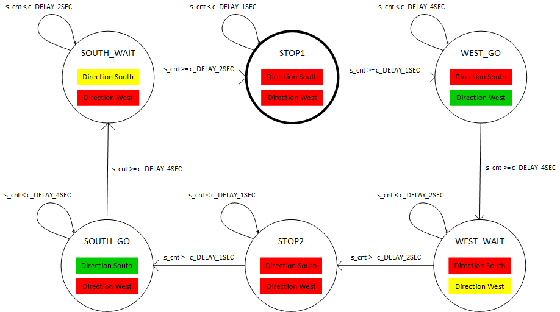
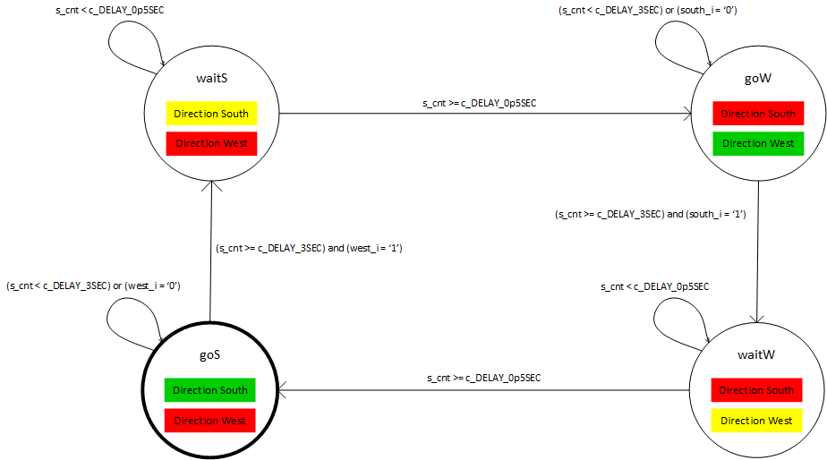

# Lab 08 - Traffic light controller

[https://github.com/xcadaj00/Digital-electronics-1/](https://github.com/xcadaj00/Digital-electronics-1/)

## Preparation tasks

### Completed state table

| **Input P** | `0` | `0` | `1` | `1` | `0` | `1` | `0` | `1` | `1` | `1` | `1` | `0` | `0` | `1` | `1` | `1` |
| :-- | :-: | :-: | :-: | :-: | :-: | :-: | :-: | :-: | :-: | :-: | :-: | :-: | :-: | :-: | :-: | :-: |
| **Clock** |  |  |  |  |  |  |  |  |  |  |  |  |  |  |  |  |
| **State** | A | A | B | C | C | D | A | B | C | D | B | B | B | C | D | B |
| **Output R** | `0` | `0` | `0` | `0` | `0` | `1` | `0` | `0` | `0` | `1` | `0` | `0` | `0` | `0` | `1` | `0` |

### Figure with connection of RGB LEDs on Nexys A7 board


### Completed table with color settings

| **RGB LED** | **Artix-7 pin names** | **Red** | **Yellow** | **Green** |
| :-: | :-: | :-: | :-: | :-: |
| LD16 | N15, M16, R12 | `1,0,0` | `1,1,0` | `0,1,0` |
| LD17 | N16, R11, G14 | `1,0,0` | `1,1,0` | `0,1,0` |

## Traffic light controller

### State diagram



### Listing of VHDL code of sequential process p_traffic_fsm with syntax highlighting

```vhdl
p_traffic_fsm : process(clk)
begin
	if rising_edge(clk) then
		if (reset = '1') then       -- Synchronous reset
			s_state <= STOP1 ;      -- Set initial state
			s_cnt   <= c_ZERO;      -- Clear all bits

		elsif (s_en = '1') then
			-- Every 250 ms, CASE checks the value of the s_state 
			-- variable and changes to the next state according 
			-- to the delay value.
			case s_state is

				-- If the current state is STOP1, then wait 1 sec
				-- and move to the next GO_WAIT state.
				when STOP1 =>
					-- Count up to c_DELAY_1SEC
					if (s_cnt < c_DELAY_1SEC) then
						s_cnt <= s_cnt + 1;
					else
						-- Move to the next state
						s_state <= WEST_GO;
						-- Reset local counter value
						s_cnt   <= c_ZERO;
					end if;

				when WEST_GO =>
					-- WRITE YOUR CODE HERE
					if (s_cnt < c_DELAY_4SEC) then
						s_cnt <= s_cnt + 1;
					else
						-- Move to the next state
						s_state <= WEST_WAIT;
						-- Reset local counter value
						s_cnt   <= c_ZERO;
					end if;
				
				when WEST_WAIT =>
					-- WRITE YOUR CODE HERE
					if (s_cnt < c_DELAY_2SEC) then
						s_cnt <= s_cnt + 1;
					else
						-- Move to the next state
						s_state <= STOP2;
						-- Reset local counter value
						s_cnt   <= c_ZERO;
					end if;
					
				when STOP2 =>
					-- WRITE YOUR CODE HERE
					if (s_cnt < c_DELAY_1SEC) then
						s_cnt <= s_cnt + 1;
					else
						-- Move to the next state
						s_state <= SOUTH_GO;
						-- Reset local counter value
						s_cnt   <= c_ZERO;
					end if;
					
				when SOUTH_GO =>
					-- WRITE YOUR CODE HERE
					if (s_cnt < c_DELAY_4SEC) then
						s_cnt <= s_cnt + 1;
					else
						-- Move to the next state
						s_state <= SOUTH_WAIT;
						-- Reset local counter value
						s_cnt   <= c_ZERO;
					end if;
					
				when SOUTH_WAIT =>
					-- WRITE YOUR CODE HERE
					if (s_cnt < c_DELAY_2SEC) then
						s_cnt <= s_cnt + 1;
					else
						-- Move to the next state
						s_state <= STOP1;
						-- Reset local counter value
						s_cnt   <= c_ZERO;
					end if;

				-- It is a good programming practice to use the 
				-- OTHERS clause, even if all CASE choices have 
				-- been made. 
				when others =>
					s_state <= STOP1;

			end case;
		end if; -- Synchronous reset
	end if; -- Rising edge
end process p_traffic_fsm;
```

### Listing of VHDL code of combinatorial process p_output_fsm with syntax highlighting

```vhdl
p_output_fsm : process(s_state)
begin
	case s_state is
		when STOP1 =>
			south_o <= "100";   -- Red (RGB = 100)
			west_o  <= "100";   -- Red (RGB = 100)

			-- WRITE YOUR CODE HERE
		when WEST_GO =>
			south_o <= "100";  -- Red
			west_o  <= "010";  -- Green
		when WEST_WAIT =>
			south_o <= "100";  -- Red
			west_o  <= "110";  -- Yellow
		when STOP2 =>
			south_o <= "100";  -- Red
			west_o  <= "100";  -- Red
		when SOUTH_GO =>
			south_o <= "010";  -- Green
			west_o  <= "100";  -- Red
		when SOUTH_WAIT =>
			south_o <= "110";  -- Yellow
			west_o  <= "100";  -- Red

		when others =>
			south_o <= "100";  -- Red
			west_o  <= "100";  -- Red
	end case;
end process p_output_fsm;
```

### Screenshots of the simulation, from which it is clear that controller works correctly


## Smart controller

### State table with next states

| **Current state** | **Direction South** | **Direction West** | **Delay** | **No cars** | **Cars West** | **Cars South** | **Cars both directions** |
| :-- | :-: | :-: | :-: | :-: | :-: | :-: | :-: |
| `goS`   | green  | red    | at least 3 sec | `goS` | `waitS` | `goS` | `waitS` |
| `waitS` | yellow | red    | 0.5 sec        | `goW` | `goW` | `goW` | `goW` |
| `goW`   | red    | green  | at least 3 sec | `goW` | `goW` | `waitW` | `waitW` |
| `waitW` | red    | yellow | 0.5 sec        | `goS` | `goS` | `goS` | `goS` |

### State diagram



### Listing of VHDL code of sequential process p_smart_traffic_fsm with syntax highlighting

```vhdl
p_smart_traffic_fsm : process(clk)
begin
	if rising_edge(clk) then
		if (reset = '1') then       -- Synchronous reset
			s_state <= goS ;        -- Set initial state
			s_cnt   <= c_ZERO;      -- Clear all bits

		elsif (s_en = '1') then
			-- Every 250 ms, CASE checks the value of the s_state 
			-- variable and changes to the next state according 
			-- to the delay value.
			case s_state is

				when goS =>
					if (s_cnt < c_DELAY_3SEC) then
						s_cnt <= s_cnt + 1;
					elsif (west_i = '1') then
						-- Move to the next state
						s_state <= waitS;
						-- Reset local counter value
						s_cnt   <= c_ZERO;
					end if;

				when waitS =>
					-- WRITE YOUR CODE HERE
					if (s_cnt < c_DELAY_0p5SEC) then
						s_cnt <= s_cnt + 1;
					else
						-- Move to the next state
						s_state <= goW;
						-- Reset local counter value
						s_cnt   <= c_ZERO;
					end if;
				
				when goW =>
					if (s_cnt < c_DELAY_3SEC) then
						s_cnt <= s_cnt + 1;
					elsif (south_i = '1') then
						-- Move to the next state
						s_state <= waitW;
						-- Reset local counter value
						s_cnt   <= c_ZERO;
					end if;
					
				when waitW =>
					-- WRITE YOUR CODE HERE
					if (s_cnt < c_DELAY_0p5SEC) then
						s_cnt <= s_cnt + 1;
					else
						-- Move to the next state
						s_state <= goS;
						-- Reset local counter value
						s_cnt   <= c_ZERO;
					end if;
					
				-- It is a good programming practice to use the 
				-- OTHERS clause, even if all CASE choices have 
				-- been made. 
				when others =>
					s_state <= goS;

			end case;
		end if; -- Synchronous reset
	end if; -- Rising edge
end process p_smart_traffic_fsm;
```


